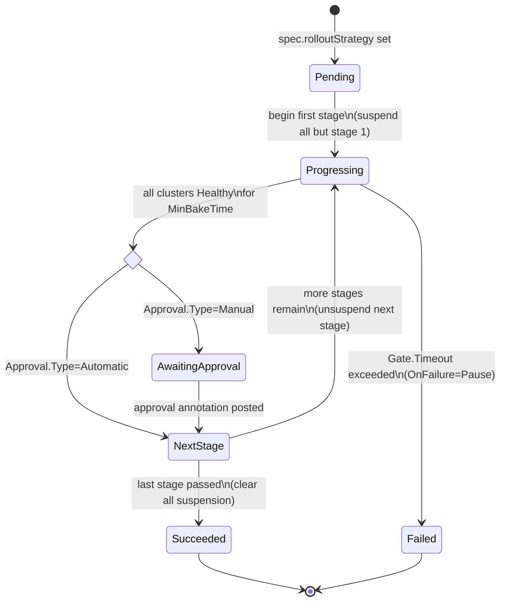

# Staged propagation for PropagationPolicy and ClusterPropagationPolicy

## Summary

Karmada has the primitives for ordered, health-gated multi-cluster
rollouts — per-cluster dispatch suspension
(`spec.suspension.dispatchingOnClusters`) and per-cluster workload health
(`ResourceBinding.status.aggregatedStatus[].health`) — but no
orchestration on top of them. Users do "update cluster A first, verify
healthy, then cluster B" by hand: poll health, patch suspension.
Error-prone, no verification signal, no defined failure behavior, no
observable state machine.

This proposal introduces an opt-in `rolloutStrategy` field on
`PropagationSpec` and a `pkg/rollout/` library invoked from the existing
binding controllers. Users declare *what* the staged rollout looks like
(ordered stages; health / bake / timeout / approval gates; failure
policy); Karmada drives the state machine. No new controller; the
feature layers on the existing suspension primitive and reuses the full
binding → Work → member-cluster data path.

## Motivation

Karmada's propagation pipeline is all-at-once: the binding controller
fans out to every scheduled cluster in parallel. This is the right
default but unsafe for:

- **Stateful services with a restart-sensitive control plane** (Trino
  coordinator: single-coordinator topology, ~30s unavailability per
  restart; simultaneous DC restart takes the service offline).
- **Blast-radius-sensitive cluster infrastructure** (ingress controllers,
  admission webhooks, CoreDNS overrides — anything managed by
  `ClusterPropagationPolicy`).
- **Tenant-driven validation** (smoke tests or CI/CD approval between
  clusters — beyond what `Health == Healthy` alone can provide).

The [dispatch-suspension
proposal](../dispatch-suspension/README.md) Story 2 describes ordered
rollout as a *manual* pattern (suspend all, release one at a time) and
correctly listed automated ordered rollout as a **Non-Goal**. This
proposal picks up that non-goal as its central goal.

### Goals

- Declare an ordered, health-gated staged rollout across the clusters
  selected by a single PP or CPP.
- Verification gate with four dials — `RequireHealthy`, `MinBakeTime`,
  `Timeout`, `Approval` (`Automatic | Manual`) — covering health-only
  auto-advance, bake-time, auto-abort on stall, and human / CI / ChatOps
  promotion.
- Declared, testable failure policy (`Pause | Continue`) so failed stages
  do not silently roll forward.
- Reuse existing primitives (`spec.suspension.dispatchingOnClusters`,
  `Work.spec.suspendDispatching`, `AggregatedStatusItem.Health`); no new
  data plane, only a new control loop.
- Opt-in per policy, alpha feature gate `StagedPropagation`, no-op for
  every existing policy.
- Symmetric support for `PropagationPolicy` and `ClusterPropagationPolicy`.

### Non-Goals

- **Traffic-shifting canary / blue-green** at the workload layer — belongs
  to Argo Rollouts / Flagger / the mesh.
- **Per-replica progressive rollout inside a single cluster** — Deployment
  / StatefulSet `strategy.rollingUpdate` domain.
- **A general-purpose multi-workload workflow engine** — anything like
  Argo Workflows (DAGs, per-step scripts) belongs outside Karmada.
- **Automatic workload-level rollback.** v1 stops the rollout; reverting
  the resource template is a GitOps concern.
- **Cross-policy synchronization** — independent PPs do not coordinate.

## Proposal

The core primitive is `PropagationSpec.rolloutStrategy`. Setting it to
`Staged` switches propagation from all-at-once dispatch to a
controller-driven state machine that unlocks one stage's clusters at a
time by writing per-cluster suspension onto the associated
`ResourceBinding` / `ClusterResourceBinding`. All other propagation
semantics — scheduling, placement, override policies, work generation,
execution, status aggregation — are unchanged. `rolloutStrategy` is
supported symmetrically on `PropagationPolicy` and
`ClusterPropagationPolicy` from v1.

### User Stories

The user stories below describe multi-DC stateful workloads where at
least one cluster must remain serving during any change — a common
requirement for HA-sensitive teams whose workloads take a real
availability hit on restart (databases, query engines, stateful
control planes).

#### Story 1: Sequential multi-DC rollout with health gating

As a service owner running the same HA workload across DC1 and DC2, I
want a configuration change (adding a data source, rotating a
credential, bumping a container image) to roll out to DC1 first, hold
until DC1 is healthy for 60s, and only then proceed to DC2 — so DC2
keeps serving while DC1 restarts.

```yaml
kind: PropagationPolicy
spec:
  # ... resourceSelectors, placement ...
  rolloutStrategy:
    type: Staged
    staged:
      stages:
        - name: dc1
          clusterNames: [member-east]
          gate: {requireHealthy: true, minBakeTime: 60s, timeout: 10m}
        - name: dc2
          clusterNames: [member-west]
          gate: {requireHealthy: true, minBakeTime: 60s, timeout: 10m}
      onFailure: {action: Pause}
```

#### Story 2: Tenant-driven validation between stages

As a service owner, I do not trust "reports Healthy" as sufficient signal
to promote to the next DC. I want the rollout to hold DC2 in
`AwaitingApproval` after DC1 becomes healthy, so I can run a smoke-test
suite and post explicit approval before DC2 receives the change.

```yaml
stages:
  - name: dc1
    clusterNames: [member-east]
    gate: {requireHealthy: true, approval: {type: Manual}}
  - name: dc2
    clusterNames: [member-west]
    gate: {requireHealthy: true}
```

#### Story 3: Automatic pause on failed stage, protecting later clusters

If DC1 fails its gate (`Timeout` without reaching `Healthy`, or approval
denied), I want the rollout to *pause* without propagating to DC2, so
DC2 stays on the previous known-good configuration until I intervene. I
do **not** want automatic workload-level revert — my resource template
is git-controlled.

### Notes/Constraints/Caveats

- **Not a scheduling change.** The scheduler still owns `RB.spec.clusters`;
  staged rollout only decides *when* already-scheduled clusters receive
  the update.
- **Not a data-plane change.** The binding controller gets one new
  responsibility (writing `spec.suspension.rollout` + `status.rollout` via
  `pkg/rollout/`); execution and work-status controllers are unchanged.
- **Health semantics are pre-existing.** `RequireHealthy` reuses
  `AggregatedStatusItem.Health` from `InterpretHealth`. Resources without
  a health rule have `Health == Unknown`; use `Approval: Manual` or
  `RequireHealthy: false` for those.
- **Interaction with existing `spec.suspension`.** The dispatch decision
  is the union of user-declared (`Dispatching`, `DispatchingOnClusters`)
  and controller-managed (`Rollout.SuspendedClusters`) suspension. A
  user-suspended cluster is never un-suspended by a rollout stage.
- **Rollout state is per-workload, not per-policy.** One PP selecting N
  resource templates produces N ResourceBindings, each advancing
  independently. Cross-RB synchronization is a v2 extension.
- **A stage may contain multiple clusters.** `RolloutStage.clusterNames`
  is a list; gate semantics are atomic per stage — every cluster in the
  stage must simultaneously report `Health == Healthy` and remain so for
  the entire `MinBakeTime` window. If any cluster flaps, the bake clock
  resets for the whole stage. A stage never partially advances.

### Risks and Mitigations

| Risk | Mitigation |
|---|---|
| Binding controller and detector race on `RB.spec.suspension` | Separate controller-owned field (`Suspension.Rollout`); the detector's `MergePolicySuspension` only overwrites the embedded user-declared part. |
| Rollout stalls on unreachable cluster | `Unknown` is treated as "not yet Healthy"; `Timeout` bounds the wait; `OnFailure: Pause` prevents cascading. |
| User edits resource template mid-rollout | Generation change marks the rollout `Superseded` and restarts from stage 1 (Deployment precedent). |
| `Health == Healthy` is a weak signal | Users needing stronger validation use `Approval: Manual` + external validator (CI, ChatOps). Karmada holds the door; it does not run the tests. |
| Binding controller crashes mid-rollout | `pkg/rollout/` is a pure function; state is fully recovered from `status.rollout` + `spec.suspension.rollout` on the next reconcile. |

## Design Details

### API changes

Add `RolloutStrategy` to `PropagationSpec` (shared between PP and CPP).

```go
// pkg/apis/policy/v1alpha1/propagation_types.go
type PropagationSpec struct {
    // ... existing fields ...
    RolloutStrategy *RolloutStrategy `json:"rolloutStrategy,omitempty"`
}

type RolloutStrategy struct {
    // +kubebuilder:validation:Enum=AllAtOnce;Staged
    // +kubebuilder:default=AllAtOnce
    Type   RolloutStrategyType `json:"type"`
    Staged *StagedRollout      `json:"staged,omitempty"` // required when Type=Staged
}

type StagedRollout struct {
    // +kubebuilder:validation:MinItems=1
    Stages    []RolloutStage        `json:"stages"`
    OnFailure *RolloutFailurePolicy `json:"onFailure,omitempty"` // default {Action: Pause}
}

type RolloutStage struct {
    // +kubebuilder:validation:Pattern=`^[a-z0-9]([-a-z0-9]*[a-z0-9])?$`
    Name string `json:"name"`
    // ClusterNames must be a subset of spec.placement's selection at
    // reconcile time; unknown names are ignored and reported in status.
    // +kubebuilder:validation:MinItems=1
    ClusterNames []string          `json:"clusterNames"`
    Gate         *RolloutStageGate `json:"gate,omitempty"` // if unset, advance on Applied=true
}

type RolloutStageGate struct {
    RequireHealthy *bool             `json:"requireHealthy,omitempty"` // default true
    MinBakeTime    *metav1.Duration  `json:"minBakeTime,omitempty"`    // default 0
    Timeout        *metav1.Duration  `json:"timeout,omitempty"`        // default 30m
    Approval       *ApprovalGate     `json:"approval,omitempty"`       // default {Type: Automatic}
}

// ApprovalGate.Type is Automatic | Manual.
// RolloutFailurePolicy.Action is Pause | Continue (default Pause).
```

Add `Rollout` to `workv1alpha2.Suspension` (per-binding, controller-owned):

```go
// pkg/apis/work/v1alpha2/binding_types.go
type Suspension struct {
    policyv1alpha1.Suspension `json:",inline"`
    Scheduling *bool               `json:"scheduling,omitempty"`
    Rollout    *RolloutSuspension  `json:"rollout,omitempty"` // NEW; controller-owned
}

type RolloutSuspension struct {
    ActiveStage       string   `json:"activeStage,omitempty"`
    SuspendedClusters []string `json:"suspendedClusters,omitempty"`
}
```

`Rollout` mirrors the existing `Scheduling` sibling field: both are
controller-owned sub-fields of the binding-level `Suspension`, distinct
from the embedded `policyv1alpha1.Suspension` block (`Dispatching`,
`DispatchingOnClusters`) that the detector rewrites on every reconcile
via `util.MergePolicySuspension`. This structural separation — sibling
fields, not overlapping fields — is what prevents the
detector-vs-rollout write race (Risk #1); the `Scheduling` field has
relied on the same guarantee since it was introduced.

Add `Rollout` to `ResourceBindingStatus` (per-binding, controller-owned):

```go
// pkg/apis/work/v1alpha2/binding_types.go
type ResourceBindingStatus struct {
    // ... existing fields (SchedulerObservedGeneration, Conditions,
    // AggregatedStatus, etc.) ...
    Rollout *RolloutStatus `json:"rollout,omitempty"` // NEW; controller-owned
}

type RolloutStatus struct {
    // ObservedGeneration is the RB.metadata.generation observed by
    // pkg/rollout.Compute. A mismatch with metadata.generation triggers
    // a restart from stage 1 (see "Corner cases: Spec change mid-rollout").
    ObservedGeneration int64 `json:"observedGeneration,omitempty"`

    // Phase is the top-level state of the rollout state machine.
    // +kubebuilder:validation:Enum=Pending;Progressing;AwaitingApproval;Succeeded;Failed
    Phase RolloutPhase `json:"phase"`

    // CurrentStage names the stage currently in flight.
    // Empty when Phase is Pending or Succeeded.
    CurrentStage string `json:"currentStage,omitempty"`

    // Stages carries per-stage progress, ordered to match spec.rolloutStrategy.staged.stages.
    Stages []RolloutStageStatus `json:"stages,omitempty"`

    // Conditions surface rollout status via the standard metav1.Condition
    // shape for kubectl integration and alerting.
    // Well-known types: "Progressing", "Healthy", "Approved".
    Conditions []metav1.Condition `json:"conditions,omitempty"`
}

type RolloutPhase string

const (
    RolloutPhasePending          RolloutPhase = "Pending"
    RolloutPhaseProgressing      RolloutPhase = "Progressing"
    RolloutPhaseAwaitingApproval RolloutPhase = "AwaitingApproval"
    RolloutPhaseSucceeded        RolloutPhase = "Succeeded"
    RolloutPhaseFailed           RolloutPhase = "Failed"
)

type RolloutStageStatus struct {
    // Name matches the corresponding spec stage name.
    Name string `json:"name"`

    // Phase reports this stage's individual state (same enum as
    // RolloutStatus.Phase).
    // +kubebuilder:validation:Enum=Pending;Progressing;AwaitingApproval;Succeeded;Failed
    Phase RolloutPhase `json:"phase"`

    // HealthyClusters are clusters in this stage currently reporting
    // AggregatedStatusItem.Health == Healthy.
    HealthyClusters []string `json:"healthyClusters,omitempty"`

    // UnhealthyClusters are clusters in this stage currently reporting
    // Unhealthy or Unknown.
    UnhealthyClusters []string `json:"unhealthyClusters,omitempty"`

    // HealthySince is when all clusters in this stage first became
    // continuously Healthy. Used by pkg/rollout.Compute to evaluate
    // MinBakeTime across reconciles. Reset to nil if any cluster flaps
    // back to Unhealthy — required so the bake-time clock is not held
    // in-process (survives controller-manager restart; see Risk #5).
    HealthySince *metav1.Time `json:"healthySince,omitempty"`

    // StartedAt is when this stage was first entered. Used to evaluate
    // Gate.Timeout.
    StartedAt *metav1.Time `json:"startedAt,omitempty"`

    // CompletedAt is when this stage exited (success or failure).
    CompletedAt *metav1.Time `json:"completedAt,omitempty"`

    // Message is a human-readable summary for the current state
    // (populated on transition; useful for `kubectl describe`).
    Message string `json:"message,omitempty"`
}
```

`ClusterResourceBinding` embeds `ResourceBindingSpec` /
`ResourceBindingStatus` (`binding_types.go:567-577`), so the same
`Rollout` field applies to CRB without additional struct changes.

**Where suspension is written.** Rollout suspension is written **onto the
RB / CRB** via `Suspension.Rollout.SuspendedClusters` — **not** onto
`PropagationPolicy.spec.suspension`. Writing to PP spec would (a) cause
GitOps drift (Argo CD / Flux would fight the rollout controller), (b)
force reconcile fan-out through the detector on every stage transition
(one PP → N RBs → N×M Works), and (c) collide with user-declared static
suspension in the same field. Writing on RB avoids all three.
`shouldSuspendDispatching` in `pkg/controllers/binding/common.go` is
extended to take the union of user-declared and controller-managed
suspension. `util.MergePolicySuspension` (`pkg/util/binding.go:129`) is
unchanged — it only overwrites the embedded `policyv1alpha1.Suspension`
part, so the new `Rollout` sub-field survives detector reconciles.

### Scale considerations

`suspendedClusters` and per-stage cluster lists grow with target-cluster
count, using the same string-array shape as existing `spec.clusters` and
`status.aggregatedStatus`. At 30-char cluster names: 500 clusters
≈ 15 KB (1% of the 1.5 MB etcd object limit); 5,000 ≈ 150 KB (10%);
50,000 hits the limit and is not supported. Realistic single-RB target
counts are 5 – 500; largest known Karmada fleets are in the low
thousands, well within limits. Reconcile churn is bounded by *stage
count*, not cluster count — each transition writes the RB spec once,
same fan-out any RB spec change produces today. A compact encoding
(store `activeStage` only, recompute suspended set at dispatch time)
could reduce this to O(1) but is deferred; starting with the explicit
list preserves forward compatibility (a compact field can be added later
without a breaking change).

### Rollout reconciliation

**No new controller.** The state machine lives as a `pkg/rollout/`
library of pure functions, invoked from the existing binding controller
(`binding_controller.go`) and cluster-binding controller
(`cluster_resource_binding_controller.go`) whenever
`spec.rolloutStrategy != nil`. `pkg/rollout/` exposes a single
`Compute(strategy, prevStatus, aggregatedStatus, scheduledClusters,
approvals, now)` function returning the suspended-cluster set, a new
`RolloutStatus`, a `requeueAfter` duration, and events to emit. All
time-, health-, and approval-related logic lives inside `Compute`; the
binding controller wires it up, writes `spec.suspension.rollout` and
`status.rollout`, and returns `ctrl.Result{RequeueAfter: requeueAfter}`
— the standard controller-runtime pattern for `MinBakeTime` / `Timeout`
/ approval polling. The existing `ensureWork` call reads the updated
`Suspension` via `shouldSuspendDispatching` (unchanged data path).

**Observable `status.rollout.phase` transitions (per RB).** The five
solid states below are the values of `RolloutPhase` written to
`status.rollout.phase` — the observable contract with users
(`kubectl get rb -o jsonpath='{.status.rollout.phase}'`). `GateCheck`
and `NextStage` are decision points, not persistent phases. Each
transition is computed by `pkg/rollout/Compute` on the next
binding-controller reconcile (triggered by generation change, a health
transition, an approval annotation, or the `requeueAfter` timer).
Alongside `phase`, `status.rollout.currentStage` records *which* stage
is in flight — so `Progressing` with `currentStage=dc1` and
`Progressing` with `currentStage=dc2` share a phase but are visibly
distinct.



Side effect on `spec.suspension.rollout.suspendedClusters` on each
entry: `Pending` and `Progressing (stage N)` — every scheduled cluster
except those in stage N; `AwaitingApproval (stage N)` — same as
Progressing, held; `Succeeded` — empty (all clusters unsuspended);
`Failed (stage N)` — every scheduled cluster in stages after N (later
stages stay on the known-good version).

**Reconcile trigger.** The bare `GenerationChangedPredicate{}` on the
binding controllers (`binding_controller.go:190`,
`cluster_resource_binding_controller.go:189`) is replaced with a small
custom predicate that *also* fires on `AggregatedStatusItem.Health`
transitions and approval-annotation changes — but **only when
`spec.rolloutStrategy != nil`**, so the common non-rollout path is
unaffected.

Downstream propagation is unchanged: `Suspension.Rollout` lives in spec,
so each transition bumps `metadata.generation`; the existing execution
controller (`execution_controller.go:137`) re-runs via its own
`GenerationChangedPredicate`. No downstream controller changes.

### Reschedule mid-rollout

The scheduler owns `RB.spec.clusters` and can update it any time. On each
reconcile, `pkg/rollout/` computes the expected suspended set as
`union(clusters in later stages) ∪ (unreached clusters in the current
stage)`, intersected with the current `spec.clusters`. Clusters that
appear in `spec.clusters` but no stage are left unsuspended and produce a
`Warning` event; clusters removed mid-stage no longer block the gate.

### Failure handling

`OnFailure.Action`:

- **Pause** (default) — set `phase = Failed`, keep later stages'
  clusters suspended, emit `RolloutStageFailed`, and stop requeuing.
  User recovery options: (a) fix the resource template (generation bump
  restarts from stage 1), (b) manually approve the failed stage, or
  (c) delete `spec.rolloutStrategy` to fall back to all-at-once.
- **Continue** — advance despite failure. Emits a `Warning` event. Rare.

**No automatic workload-level rollback in v1.** Karmada does not
snapshot / revert `spec.resource` on failure — that is a GitOps /
`kubectl rollout undo` concern. What v1 does guarantee is that later
stages stay on the previously known-good version because their
`Work.spec.suspendDispatching` remains `true`.

### Approval delivery

v1 uses **annotation-driven approval**: external validators (CI, ChatOps,
`karmadactl rollout approve`, or a human running `kubectl annotate`) set
`rollout.karmada.io/approve: <stage-name>` on the ResourceBinding. The
annotation is consumed and cleared on the next reconcile. RBAC is coarse
(anyone with `patch` on `bindings` can approve); a follow-up may
introduce a small helper CRD (`RolloutApproval`) for finer-grained
approver roles. A true Kubernetes subresource (`/approve`) is impractical
because CRDs cannot declare arbitrary subresources.

### Feature gate and defaulting

- Feature gate `StagedPropagation` (alpha in v1). When disabled, the
  webhook rejects any policy with `spec.rolloutStrategy != nil`.
- When `spec.rolloutStrategy` is unset, existing behavior is preserved
  verbatim; the binding controllers skip `pkg/rollout/` entirely.
- Defaults: `RolloutStrategy.Type=AllAtOnce`, `Gate.RequireHealthy=true`,
  `Gate.Timeout=30m`, `Approval.Type=Automatic`, `OnFailure.Action=Pause`.

### Corner cases

- **Spec change mid-rollout** — generation bump marks the rollout
  `Superseded`; `pkg/rollout/` resets `status.rollout.stages` and restarts
  from stage 1 (Deployment precedent).
- **Cluster unreachable** — treated as "not yet Healthy" until
  `Gate.Timeout` elapses, then `OnFailure` fires.
- **Deletion during rollout** — same as the dispatch-suspension corner
  case: `Work` deletion is not blocked by `spec.suspendDispatching`;
  the binding controller clears `spec.suspension.rollout` on the
  deletion-triggered reconcile.
- **Overlap with user-declared static suspension** — static suspension
  wins (union semantics). A validation warning is emitted; the policy is
  not rejected.
- **Interaction with `Failover`** — failover to a still-suspended
  later-stage cluster would land the workload on an out-of-date cluster.
  v1 does not pause failover during a rollout; documented as a known
  limitation.

### Test Plan

**Unit:** validation (`type=Staged` requires `staged`, stage-name
uniqueness, non-empty `clusterNames`, duration bounds);
`pkg/rollout/Compute` transitions (Pending → Progressing →
AwaitingApproval → Succeeded; Progressing → Failed on `Timeout`;
regeneration restarts from stage 1; scheduler-driven `spec.clusters`
changes reconcile cleanly); widened watch predicate;
`shouldSuspendDispatching` union semantics.

**Integration & E2E:** three-stage Deployment rollout across three
clusters verifying per-stage `Work.spec.suspendDispatching` toggling;
`OnFailure: Pause` with a stuck-Unhealthy workload (later clusters stay
suspended); `Approval: Manual` annotation-driven promotion; CPP path
with mixed namespaced + cluster-scoped targets; GitOps interaction
(fluxcd/argocd sync of the PP does not fight rollout progression —
proves we do not write to PP spec).

## Alternatives

**Write suspension on PP / CPP spec instead of RB / CRB.** Rejected —
would cause GitOps drift (Argo CD / Flux would fight the rollout), fan
out through the detector on every stage transition (one PP → N RBs → N×M
Works), and collide with user-declared static suspension in the same
field.

**Other API shapes.** A separate `RolloutPolicy` CRD is deferred; a
pause/resume-only version was
[considered and set aside](../dispatch-suspension/README.md#alternatives)
in the dispatch-suspension review, and the inline-on-PP shape avoids the
"two-policies-own-the-same-field" problem. Overloading
`spec.placement.clusterAffinities` ordering is rejected because
`ClusterAffinities` orders scheduling *fallback groups*
(`propagation_types.go:454-485`), not dispatch, and has nowhere to hang
per-stage gate configuration.

**Push staged rollout to an external orchestrator (Argo Workflows /
Flagger).** Rejected as the *only* option; retained as complementary.
External orchestrators can drive suspension today, but every team
reinvents the same state machine, health polling, and approval plumbing.
Bringing the three most-common patterns (health-gate, bake-time,
approval) into Karmada eliminates that duplication and enables
`kubectl rollout status pp/<name>` as first-class UX.

**Dedicated `karmada-rollout` controller.** Rejected for v1. A dedicated
controller adds a new binary / RBAC surface / leader-election lease for
a state machine whose *only* output (`RB.spec.suspension.rollout`) is
consumed by the binding controller on its own reconcile — an unnecessary
inter-controller hand-off. Extracting later is a mechanical refactor:
the API is neutral to which controller writes it.

### Prior art

- **Argo Rollouts** — `spec.strategy.canary.steps` with pause/analysis,
  single cluster; informs the gate design.
- **Flagger** — progressive delivery with custom metric analysis, single
  cluster; motivates the (deferred) `AnalysisGate` extension.
- **Fleet (Rancher)** — `rolloutStrategy` on `GitRepo` / `Bundle` with
  `maxUnavailable` and `partitions[].targets`. Closest multi-cluster analog.
- **OCM** — `Placement` decision groups + `ClusterRolloutStrategy` on
  `ManifestWorkReplicaSet`. Directly relevant multi-cluster precedent.

## Appendix — anchor points in the current codebase

| Concern | File |
|---|---|
| `PropagationSpec` / `Suspension` | `pkg/apis/policy/v1alpha1/propagation_types.go:62-220, 254-277` |
| RB / CRB `Suspension` / status | `pkg/apis/work/v1alpha2/binding_types.go:401-414, 469-495, 567-577` |
| Per-cluster suspend decision | `pkg/controllers/binding/common.go:363-376` |
| Execution controller skip-on-suspend | `pkg/controllers/execution/execution_controller.go:120-123` |
| Detector's `MergePolicySuspension` call sites | `pkg/detector/detector.go:501, 594, 644` |
| Shared validation | `pkg/util/validation/validation.go:43-99` |
| Feature gates | `pkg/features/features.go` |
